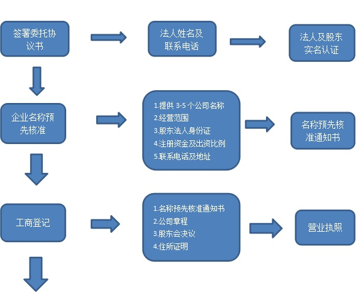
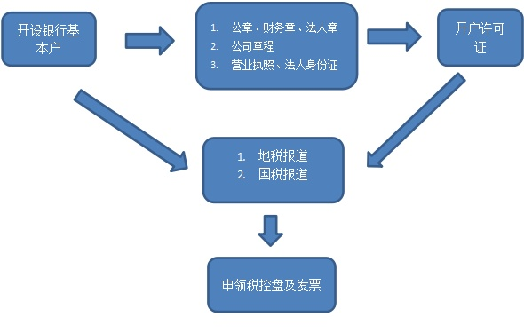
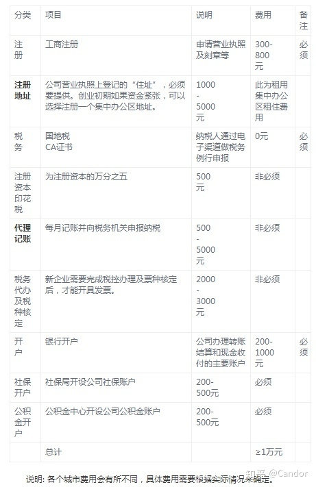
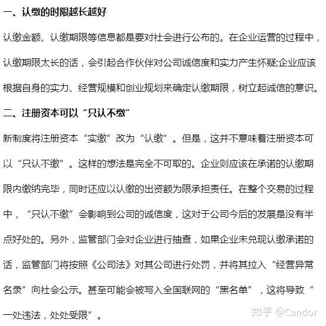
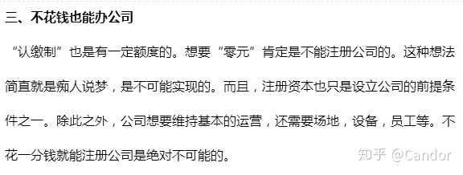

# 企业注册（北京）

下面是参考百度词条和知乎有过注册企业经历的人所述的内容总结的北京注册企业流程。

总结中涉及到的 doc 范本均来源于工商局官网 [原北京工商行政管理局](gsj.beijing.gov.cn) 和 [中华人民共和国工商行政管理总局](home.saic.gov.cn) 下载。

使用原北京工商行政管理局前需要直接开始核名请点击 __网上登记__。

下方流程涉及咨询事项参考 [北京方面工商局及分局电话](https://zhidao.baidu.com/question/323921581.html)，该电话官网未提供具体明细，只能参考这里的百度词条。

以下涉及具体流程解释和 tips 的内容参考来自 [知乎回答 @嵇可睿 回答](https://www.zhihu.com/question/19585093) 和 [知乎回答 @亚新通达公司注册](https://www.zhihu.com/question/54570629)

## 流程

1. 向工商局申请公司名称核准；通过后领取：__[企业名称预先核准通知书](http://home.saic.gov.cn/fw/bsdt/ztbs/qydj/mcdj/mcyxhz/)__

  1-3个工作日（百度词条预估时间）

2. 租房：要有证件做产权证明，如租房合同，并让房东提供房产证的复印件。

   这一流程参考百度词条的解释。
   > 注：住所使用证明材料的准备，分为以下三种情况：
   
   >（1）若是自己房产，需要房产证复印件，自己的身份证复印件；
   
   >（2）若是租房，需要房东签字的房产证复印件，房东的身份证复印件，双方签字盖章的租赁合同，和租金发票；
   
   >（3）若是租的某个公司名下的写字楼，需要该公司加盖公章的房产证复印件，该公司营业执照复印件，双方签字盖章的租赁合同，还有租金发票。
   
   因为此流程比较关键，优先程度较高，参考知乎的解释。
   > 找到了房子，你也就找到了会在哪个区注册，虽然现在可以跨区核名，但是先搞定房子，后续手续会比较好办。而且房子这个东西一旦定下来，会决定后期很多的东西，所以建议先把房子搞定。
   
   > 搞定的定义就是：
   
   > 确定该房子可以注册公司；
   
   > 能拿到房子的房本复印件以及房主的签名；

3. [公司章程](./公司章程-范本.doc)，由所有股东签名。

  参考知乎对该流程的解释。
  
  > 公司章程的模板工商局网站上有，直接下来照着改就可以，不过需要确定很多东西，摘要如下：
  
  > 1. 公司的合伙人的出资比例，担任职务；
  
  > 2. 公司的组织架构以及法人代表；
  
  > __关于章程的一些 tips__
  
  > 1. 关于职位，必须有的三个职位是：董事长/执行董事；监事；总经理。总经理可以兼任；
  
  > 2. 在公司章程的最后需要股东全员的签名，但是章程是在提交的时候一定会被改的，所以最好在签名那页单独成页用来签名，这样前面的章程调整最后一页都可以直接用；

4. 刻 [法人章](https://baike.baidu.com/item/%E6%B3%95%E4%BA%BA%E7%AB%A0)，一般店里都可以刻。

  该流程参考知乎建议。

  > 因为在银行的手续都会留章，签名是不行的，所以最好没事先去刻个自己的人名章。规格18*18就可以，材料一定选透明有机玻璃的，因为有些银行(比如建行)是不认可红色胶章的，据我了解了一下，人名章有机玻璃的是基本通用的，所以材料一定要选对。

5. 实缴需要到会计师事务所领取 [银行询证函](./银行询证函.doc)，认缴制可以忽略此步骤。

  PS: 这里经过查询似乎国内都是走认缴制。

6. 银行开立公司验资户：银行会发给每个股东缴款单并在询证函上盖银行的章，询证费各银行不同。【认缴制可以忽略此步骤】

  该流程涉及较为复杂，如果是非认缴制，请参考知乎 [第三节 验资](https://www.zhihu.com/question/19585093) 的解释。

7. 办理验资报告：由会计师事务所出具验资报告。【认缴制可以忽略此步骤】
  > 对于注册资金都实行认缴了，所以现在是肯定不需办理验资报告了。也就是说验资这个环节就可省去，有效的降低了投资公司的成本，同时也进一步降低了创业门槛，激发了市场活力。而且新政策实施后，也的确迎来了公司注册的一个高潮。 -- 参考 [知乎专栏](https://zhuanlan.zhihu.com/p/44361192)

8. 到工商局窗口办理，领取营业执照（网上公司设立时预约的窗口）

  5-15个工作日（百度词条预估时间）

  带上以下资料：
    1. 注册地址证明（租赁合同、房产证等）
    2. [股东会决议](./股东会决议.doc)
    3. 股东、法人身份证
    4. 验资报告
    5. 公司章程
    6. 公司设立登记表
    7. 企业名称预先核准通知书

9. 凭营业执照到公安局备案刻章，备案完成再到指定刻章店刻章。（公章及财务章必须刻，其他章可需要再刻。）

  1—2个工作日（百度词条预估时间）

10. 30日内到当地税务局办理税务报到。税务局将核定企业缴纳税金的种类、税率、等事务。（公司成立后次月必须报税，即便没有营业收入也需要建账及零申报。）

11. 去银行开基本户。（把前面办理的所有证件及资料都带上就对了！）

__最后提供一份来自 [知乎](https://www.zhihu.com/question/54570629) 的流程示意图__。

## 费用评估

参考知乎专栏

## 注意事项

参考知乎专栏，主要误区有以下三条

## 代理信息

以下信息均来自 Google 搜索，真实性还望真正咨询前自行考量。

- [万企汇](http://jn.520gongsi.cn/)
- [北京诺亚互动财务顾问有限公司](http://www.87793798.cn/)
- [中投世纪](http://www.pinggu168.com/gongsizhuce/)
- [腾讯创业服务平台](https://c.qq.com/cateTopic/view)

