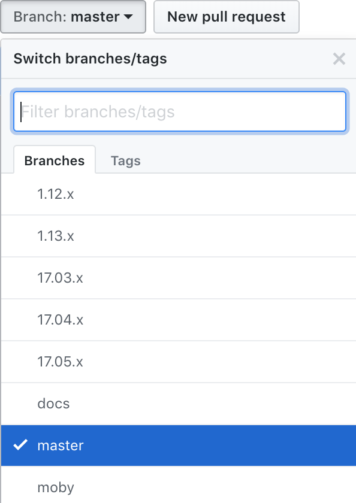
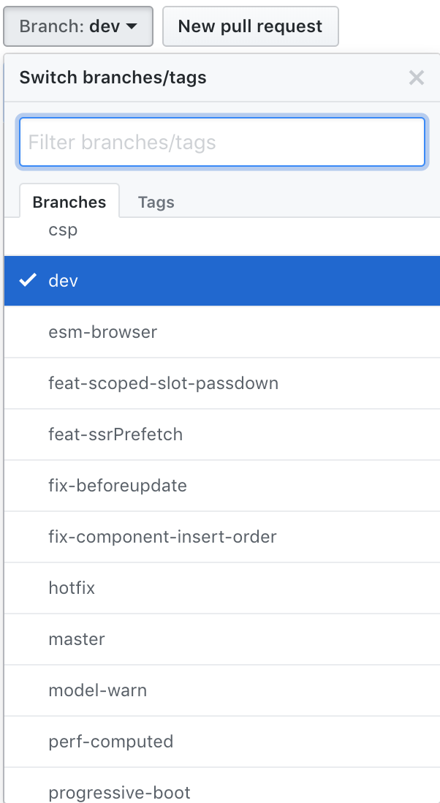
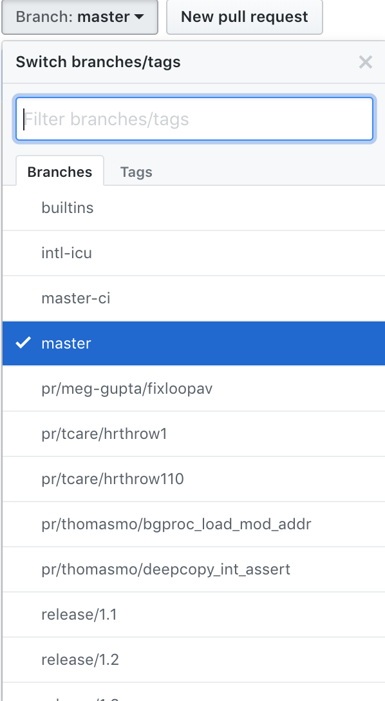
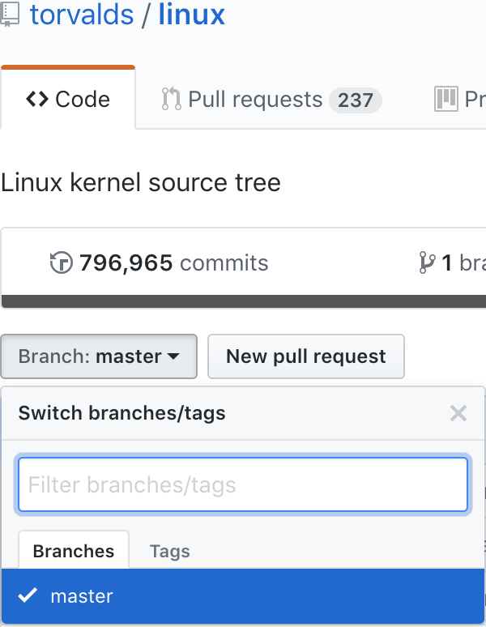

# Git Practice

以下内容参考开源已有规范解决多人协作的流程化问题。

## Gitflow Workflow

Gitflow Workflow 是基于 Git 人为设计的工作流程，为每个分支提供严格的意图定义，目的在于围绕管理较为庞杂的项目中多人协作流程提供标准，在使用中并没有附加任何新的技术概念。

最早由 [Vincent Driessen at nvie](https://nvie.com/posts/a-successful-git-branching-model/) 提出，作者提供了分支管理和发布的策略图。


### 适用场景

相较之下，开源项目的维护复杂性和可控性更为不确定，以下给出不同领域开源项目的分支管理情况。

- Docker 的分支管理

  Docker 项目经过了项目更迭的阵痛期，为了兼容更名为 moby 之前的版本，采用了版本号作为分支的语义。

  

- Vue 的分支管理

  因为是企业推广的开源项目，分支管理使用了严格的 Git Workflow 标准。

  
  
- ChakraCore 的分支管理

  ChakraCore 虽然采用了 Git Workflow 的管理方式，但是结合自身项目的特点，default 分支设置为 master。

  
  
- Linux 的分支管理

  Linux 的分支管理鉴于维护者的强制纯净策略，只保留了 master 作为唯一项目分支。

  
  

对比与开源项目的不可控因素，企业场景更加有助于规范在团队协作中推广。

### 获取扩展工具

该设计经过企业项目实践，可以适用于不同技术领域的团队协作，针对 Web 前端而言，考虑到开发中与 Git 交互的场景性，建议使用 Shell 封装的命令行工具 [nvie/gitflow](https://github.com/nvie/gitflow)，该工具仅为 Git 本身的扩展，并没有破坏其原有设计结构和侵入式的概念。

官方提供了不同操作系统平台下的集成方案 [Github - gitflow/Installation](https://github.com/nvie/gitflow/wiki/Installation)，以下直接给出获取方式，Linux 平台请自行参考链接。

- Mac OS X

  ```
  brew install git-flow
  ```

- [Windows](https://git-scm.com/download/win)

### 流程解剖

参考 [Bitbucket gitflow-workflow](https://www.atlassian.com/git/tutorials/comparing-workflows/gitflow-workflow)  针对 Vincent Driessen 的方案结合扩展插件使用作出的流程分解。

再次关注 Vincent Driessen 提供的策略图，以下作出分解，这里着重理解 branch 的__语义__和在整个流程中扮演的__角色__。

#### Develop and Master Branches


作为长期留存于仓库的两个长期分支，GitFlow 中的 master 分支记录了与 release 保持一致的发布轨迹，可以以 tag number 的形式标记发布的里程碑。

而 develop 分支由 master fork 而出，完整的记录了 master 中的所有内容，作为开发者持续集成的上游分支。

管理员可以从 master fork develop 并推送至远端仓库为项目创建 develop

```
git branch develop
git push -u origin develop
```

使用 extension 则可以快速在本地创建符合 Git Flow 规范的配置，详细信息记录于 `.git/config` 中。

```
$ git flow init
Initialized empty Git repository in ~/project/.git/
No branches exist yet. Base branches must be created now.
Branch name for production releases: [master]
Branch name for "next release" development: [develop]

How to name your supporting branch prefixes?
Feature branches? [feature/]
Release branches? [release/]
Hotfix branches? [hotfix/]
Support branches? [support/]
Version tag prefix? []

$ git branch
* develop
 master
```

#### Feature Branches


feature 分支由 develop 分支 fork 而出，当每个开发者完成自己 feature 内容的时候，需要将其 merge 回 develop 分支。

其他的开发者之后可以同步到最新的 develop 到自己的 feature 分支。

创建 feature 分支

```
git checkout develop
git checkout -b feature_branch
```

使用 extension 快速创建 feature 分支

```
git flow feature start feature_branch
```

完成 feature 之后 merge 回 develop 分支

```
git checkout develop
git merge feature_branch
```

使用 extension 快速 merge 当前 feature 到 develop 分支

```
git flow feature finish feature_branch
```

#### Release Branches


当 develop 分支集成到足够的 feature 以满足到某个发布节点的时候，就可以从 develop 分支 fork 出 release 分支。

当完成创建并发布后，该分支需要及时 merge 到 master 和 develop 分支，从而完成一次 workflow。

之所以使用专用的角色为 release 分支赋予定义是为了完成并行开发，某种场景之下，当某个版本发布的时候，可能另一个团队正在同一时间完成下个版本的开发任务。

> Using a dedicated branch to prepare releases makes it possible for one team to polish the current release while another team continues working on features for the next release. It also creates well-defined phases of development (e.g., it's easy to say, “This week we're preparing for version 4.0,” and to actually see it in the structure of the repository).

从 develo 分支中创建 release 分支

```
git checkout develop
git checkout -b release/0.1.0
```

使用 extension 完成快速创建

```
$ git flow release start 0.1.0
Switched to a new branch 'release/0.1.0'
```

完成 release 创建并发布后，应该及时 merge 回 master 和 develop，因为该版本发布之后会迎来一些更新和修复，这些工作需要基于最新的 develop 分支进行开发。

```
git checkout develop
git merge release/0.1.0
```

使用 extension 完成合并 release 到 master 和 develop 工作

```
git flow release finish '0.1.0'
```

#### Hotfix Branches


在 Git Workflow 中，hotfix 分支是唯一直接从 master 分支直接 fork 而出的角色。

当 hotfix 涉及到的 bugs 或者文档等内容完成后，需要同时 merge 到 master 和 develop 分支中，其中 master 分支需要在合并后及时更新 tag 标签。

从 master 分支中 fork 出 hotfix 分支

```
git checkout master
git checkout -b hotfix_branch
```

使用 extension 快速创建

```
$ git flow hotfix start hotfix_branch
```

完成 hotfix 分支所涉及的内容后 merge 回 master 和 develop 分支

```
git checkout master
git merge hotfix_branch
git checkout develop
git merge hotfix_branch
git branch -D hotfix_branch
```

使用 extension 快速完成 merge 工作

```
$ git flow hotfix finish hotfix_branch
```

### 方案对比

参考 [Bitbucket - 几种工作流程对比方案](https://www.atlassian.com/git/tutorials/comparing-workflows)

须知一点，目前并没有所谓绝对的标准，即使是 Git Flow 也不过是符合企业团队规模协作的一种方案，可能相对于其他 Git Workflow 而言流程较为繁琐，但也是目前最符合中等以上团队规模协作的策略。

一种最切合团队的流程需要满足以下三点条件。

> Some things to consider when evaluating a Git workflow are:
> 
> - Does this workflow scale with team size?
> 
> - Is it easy to undo mistakes and errors with this workflow?
> 
> - Does this workflow impose any new unnecessary cognitive overhead to the team?

因此这里将介绍几种不同的工作流程设计思想，先不关注形式和具体工具链，只注重意图语义和设计。

#### Centralized Workflow

较早中心化的工作流程仅有一台中央仓库服务器，所有人需要提交更改到远端，也并不需要除 master 之外的 branch 概念，对所有人而言，看到的内容永远是准确的同一份代码。


这里的缺点不过多讨论，Git 的分布式策略和故障恢复能力的确优于 SVN 的设计，但对于从中心化工作流程迁移到分布式分支协作流程的团队而言，前者更加便于理解和掌握。

#### Feature branching

基于中心化的工作流程改良的方案，也就是开发者独立拥有分支管理各自集成进度，目前不少开源项目使用该方案进行日常协作。相较之 Gitflow，没有复杂的合并和发布流程，理解清晰。 

#### Gitflow Workflow

Gitflow 即为本文主要推荐的企业团队协作流程方案，该流程围绕 release 制定了严格的 branch model，并规定了分支间相互影响的规则。

> it assigns very specific roles to different branches and defines how and when they should interact

#### Forking Workflow

该模式较为特殊，每个开发者不仅拥有 remote server 的仓库概念，自己也拥有一个 private remote server，每次集成是本地仓库，private remote server 和 remote server 三者进行交互。


## Commitizen

通过 Git Workflow 在团队中约定了一套能够协作的流程规范后，我们还需要能够规范团队内开发成员每次提交的格式标准，这套标准需要能够在积累到一定量的提交记录后通过历史生成相应的 changelog 作为项目的文档储备。

部分开源项目会在每个成员提交代码的时候运行一段 git commit hook 脚本以检查提交日志的合法性（参考 [validate-commit-msg](https://github.com/conventional-changelog-archived-repos/validate-commit-msg) ），但是相应的缺点是缺少自动化的格式工具能够辅助人为提交的合法性。

这里我们推荐使用 [cz-cli](https://github.com/commitizen/cz-cli) 帮助开发在提交的时候通过提示必要的输入字段以录入合法的 commit history。

### cz-cli

cz-cli 是 nodejs 实现的命令行工具，我们可以直接通过 yarn 或者 npm 获取。

```
yarn global add commitizen
# or
npm install -g commitizen
```

接着需要配合 `commitizen` adapter 以便于能够提交出可以生成标准 changelog 格式的 commit history。

```
yarn global add cz-conventional-changelog
# or
npm install -g cz-conventional-changelog
```

创建 `.czrc` 在 `home` 目录下作为 commitizen 工具能够读取到的全局配置，该配置指定选择的 adapter。

```
echo '{ "path": "cz-conventional-changelog" }' > ~/.czrc
```

完成以上步骤后我们可以便捷的使用 `git cz` 取代 `git commit` 子命令。

### Conventional Changelog

通过 `cz-cli` 配合 `cz-conventional-changelog` 可以为每个成员在 commit 阶段提供规范的信息录入，但是我们还没有真正通过 commit history 生成所需的 changelog。

这里我们参考开源项目 [AngularJS's commit message convention](https://github.com/angular/angular.js/blob/master/DEVELOPERS.md#-git-commit-guidelines) 的标准通过 [conventional-changelog](https://github.com/conventional-changelog/conventional-changelog) 根据我们的 commit history 生成所需的 changelog。

Conventional Changelog 提供了 [standard-version library](https://github.com/conventional-changelog/standard-version) 作为处理生成 changelog 流程的工具，我们同样可以通过 nodejs 包管理工具获取。

作为项目依赖安装

```
yarn add standard-version -D
# or
npm i --save-dev standard-version
```

并配置运行脚本

```
{
  "scripts": {
    "release": "standard-version"
  }
}
```

或者全局安装

```
yarn global add standard-version
# or
npm i -g standard-version
```

直接通过命令行运行即可。

[注意需要跳过的 tag 阶段](https://github.com/devdigital/git-flow-standard-version)

### 使用 standard-version

我们会发现，开发成员每次提交 commit 后可能会做出封版和发布前的一系列准备工作，而这些工作又包含了生成新的提交记录和 changelog 等内容，因此 `standard-version` 可以帮助我们便利的完成这些任务。

参考 [standard-version#cli-usage](https://github.com/conventional-changelog/standard-version#cli-usage) 生产发布记录、tag 和 changelog。

### 方案对比

参考章节 [standard-version#how-is-standard-version-different-from-semantic-release](https://github.com/conventional-changelog/standard-version#how-is-standard-version-different-from-semantic-release)	

对比 [standard-version](https://github.com/conventional-changelog/standard-version) 和 [semantic-release](https://github.com/semantic-release/semantic-release)，两者都遵从了 [Angular format 规范](https://github.com/bcoe/conventional-changelog-standard/blob/master/convention.md)。前者的优势在于不会影响到远端的仓库，而后者是完全自动化处理整套流程（push, publish）
